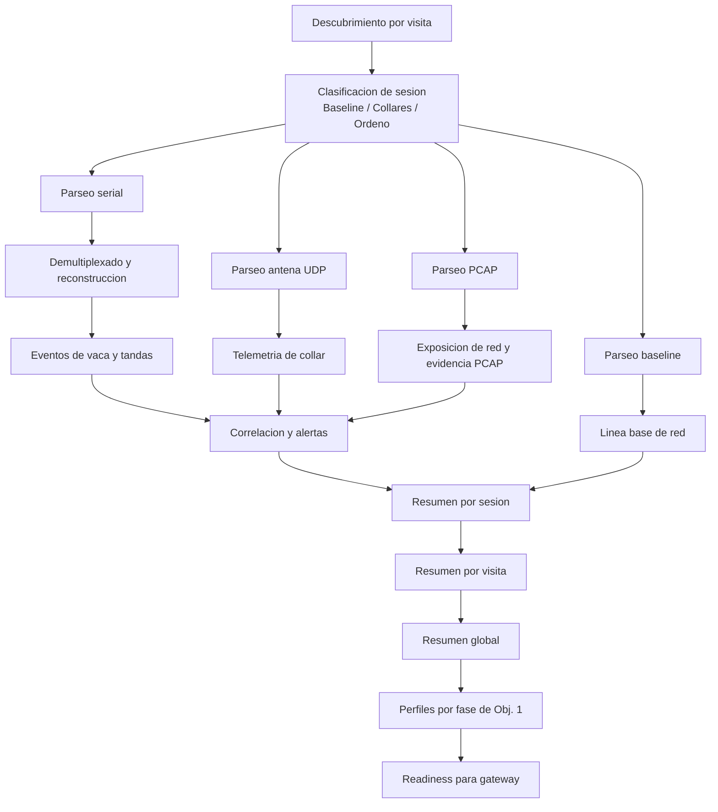

# Flujo actualizado de FincaDiag

## Motor de analisis para Objetivo 1

## Criterio metodologico

- `23/02/2026` a `13/03/2026`: linea base temprana de latencia, jitter y firmas iniciales.
- `14/03/2026` a `31/03/2026`: maduracion de red y mayor cobertura PCAP.
- `01/04/2026` a `05/04/2026`: captura madura para el motor operativo.
- `06/04/2026` a `09/04/2026`: contraste validado con campo.

## Salida esperada

- El motor no reemplaza el gateway.
- El motor entrega la linea base, las reglas de separacion por dominio y los criterios de seguridad para Obj. 3.
