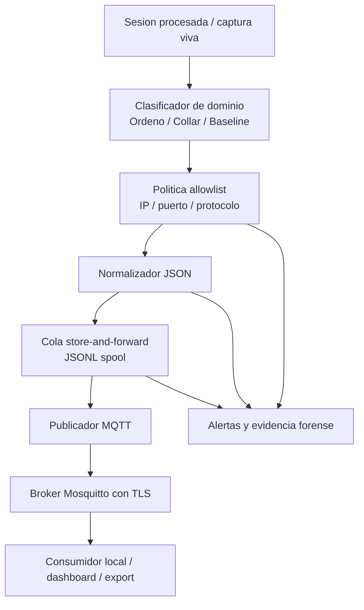

# Esqueleto del gateway perimetral

## Flujo de referencia

## Componentes creados

- `src/fincadiag/gateway/config.py`
- `src/fincadiag/gateway/policy.py`
- `src/fincadiag/gateway/normalizer.py`
- `src/fincadiag/gateway/store.py`
- `src/fincadiag/gateway/publisher.py`
- `src/fincadiag/gateway/runtime.py`

## Alcance de esta iteracion

- Ya existe normalizacion de eventos a topicos MQTT.
- Ya existe cola local para `store-and-forward`.
- Ya existe politica base de allowlist para el dominio biotico.
- Ya existe modo `dry-run` para validar el pipeline sin tocar produccion.

## Lo que aun falta para cerrar Obj. 3

- endurecer TLS 1.3 en despliegue real del broker
- validar publicacion sobre captura viva
- congelar el esquema JSON final por dominio
- contrastar `eta`, `PLR` y `MTTR` contra la linea base de Obj. 1
